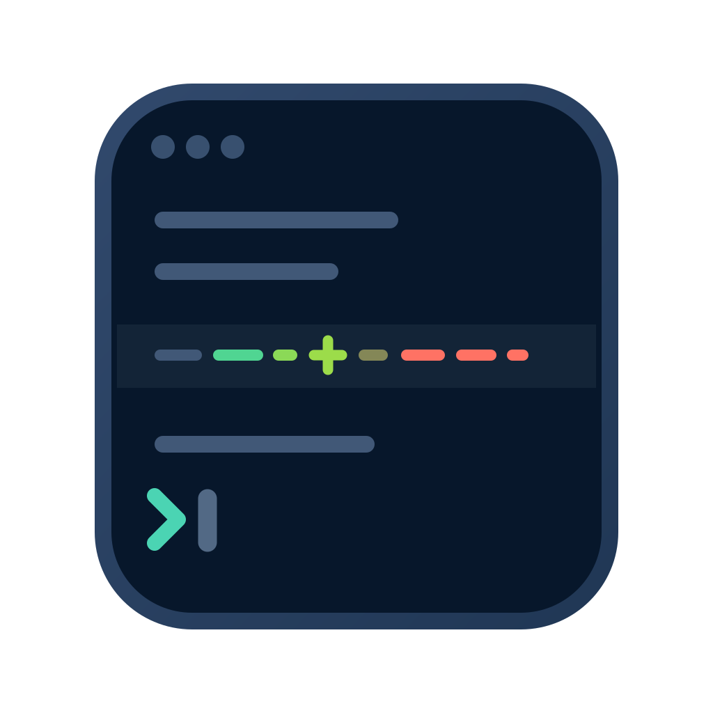

<p align="center">
  
</p>

<h1 align="center">agentlog.nvim</h1>

<p align="center">
  <em>Make AI agent scrollback readable.</em>
</p>

<p align="center">
  <a href="https://github.com/illegalstudio/agentlog.nvim/stargazers"></a>
  <a href="LICENSE"></a>
  <a href="https://neovim.io"></a>
  <a href="https://x.com/nahime0"></a>
</p>

<p align="center">
  <strong>Automatic source detection &middot; Structured document model &middot; Layered diff rendering &middot; Tree-sitter highlighting</strong>
</p>

<p align="center">
  agentlog.nvim turns terminal scrollback produced by AI agents - Codex, Claude
  Code, and Cursor Agent, opened from Zellij - into a structured, navigable
  Neovim buffer without changing its original text.
</p>

---

## Why agentlog?

I spend a lot of time running AI coding agents - usually Codex, Claude Code, and
Cursor Agent - inside Zellij. When I need to jump back through their history or
copy part of an agent's output, I prefer to stay on the keyboard: `Ctrl+S`, then
`E`, opens the active pane's scrollback in my default editor, Neovim.

That workflow is fast, but raw agent scrollback is not especially pleasant to
read. Prose, tool calls, code, and diffs all compete for attention in what is
ultimately a plain-text buffer. I wanted the output to become structured and
syntax-highlighted as soon as it reached Neovim, while keeping the original text
untouched. agentlog.nvim grew out of that need: preserving Zellij's quick,
mouse-free workflow while making AI agent output much easier to revisit,
navigate, and copy.

## Requirements

- Neovim 0.10 or newer
- A Tree-sitter parser for each language you want highlighted inside diffs

## Installation

Using [lazy.nvim](https://github.com/folke/lazy.nvim):

```lua
{
  "illegalstudio/agentlog.nvim",
  dependencies = {
    "nvim-treesitter/nvim-treesitter", -- Optional; enables immediate code highlighting.
  },
  opts = {
    -- auto_attach = true, -- Uncomment to enable automatic attachment.
  },
}
```

Calling `setup()` is optional. The commands are available with the default
configuration as soon as the plugin is on `runtimepath`.

## Usage

Open a scrollback dump in Neovim. For example, in Zellij, focus the pane running
the agent, press `Ctrl+S` to enter scroll mode, then press `E` to open that
pane's scrollback in your default editor. Once the buffer is open, run:

```vim
:AgentlogAttach
```

The command detects the matching Codex, Claude Code, or Cursor Agent adapter
from the buffer.

The initial commands are:

- `:AgentlogAttach` - parse and render the current buffer;
- `:AgentlogRefresh` - rebuild the document and its decorations;
- `:AgentlogDetach` - remove decorations and restore the previous filetype;
- `:AgentlogNext {action|diff|error|file|hunk|response}` - jump to the next region;
- `:AgentlogPrevious {action|diff|error|file|hunk|response}` - jump backward;
- `:checkhealth agentlog` - inspect the local runtime.

Automatic attachment is off by default:

```lua
require("agentlog").setup({
  -- auto_attach = true, -- Uncomment to enable automatic attachment.
  adapters = {
    claude = { enabled = true },
    codex = { enabled = true },
    cursor = { enabled = true },
  },
  render = {
    diff_background = true,
    diff_code_padding = 1,
  },
  syntax = {
    enabled = true,
    treesitter = true,
    max_region_lines = 500,
  },
  navigation = {
    wrap = true,
  },
  mappings = {
    enabled = true,
    next_action = "]a",
    previous_action = "[a",
    next_diff = "]d",
    previous_diff = "[d",
    next_response = "]r",
    previous_response = "[r",
    next_file = "]f",
    previous_file = "[f",
    next_error = "]e",
    previous_error = "[e",
    next_hunk = "]h",
    previous_hunk = "[h",
    open_file = "gf",
  },
})
```

When enabled, automatic attachment considers only `*.dump` files with a strong
Codex, Claude Code, or Cursor Agent signature and enough independent evidence. Set
`vim.b.agentlog_disable = true` before `BufReadPost` to opt a buffer out.

## Navigation

Attached buffers receive these buffer-local normal-mode mappings by default:

| Mapping | Action |
| --- | --- |
| `]a` / `[a` | Next/previous agent action |
| `]d` / `[d` | Next/previous changed diff block |
| `]r` / `[r` | Next/previous assistant response |
| `]f` / `[f` | Next/previous recognized file occurrence |
| `]e` / `[e` | Next/previous error or warning |
| `]h` / `[h` | Next/previous explicit unified-diff hunk |
| `gf` | Open the recognized file under the cursor |

Counts are supported, so `3]a` jumps forward three actions. Navigation wraps at
the buffer boundaries by default and records jumps so regular jump-list motions
can return to the previous location. A diff containing several rendered rows is
one destination; read-only source previews are not treated as changes.
File navigation still includes those read-only previews and groups all rows from
one structured file operation into a single destination.
Hunk navigation visits each `@@ … @@` section within a unified diff. Compact
Codex, Claude, and Cursor previews do not expose hunk headers, so agentlog does
not invent extra boundaries for them.

Mappings are installed only when the same key is not already mapped locally in
the attached buffer, and detach removes only mappings installed by agentlog.
Set `mappings.enabled = false` to disable all defaults, or replace any individual
mapping in `setup()`. `gf` falls back to Neovim's native behavior when the cursor
is not on a file recognized by the active adapter.

For Codex `Edited`, `Added`, and `Deleted` blocks, Claude `Update` blocks, and
Cursor `Edited` previews, agentlog separates display prefixes and diff markers
from the source, infers the language from the file path, and parses normalized
old and new snapshots. Claude `Write` previews receive the same syntax
highlighting without inventing a diff marker or visual padding. If a parser or
highlight query is unavailable, structural highlighting continues to work.
`diff_code_padding` inserts virtual screen cells, so the extra spacing never
changes copied text.

Cursor Agent's plain scrollback does not retain an explicit marker for every
prompt and response. The adapter recognizes turn boundaries supported by the
banner and surrounding tool activity, and deliberately leaves ambiguous later
turns neutral.

## Documentation

- [`doc/agentlog.txt`](doc/agentlog.txt) is the Neovim `:help agentlog` manual.
- [`docs/`](docs/README.md) contains internal architecture and development
  documentation for maintainers.

## Development

Run the headless test suite with:

```sh
make test
```

Real scrollback fixtures must be anonymized before being committed. See the
fixture notes under [`tests/fixtures/`](tests/fixtures/).

## Status

The immediate next milestone is to expand the anonymized Codex, Claude, and
Cursor fixture corpus, then add folding, copying, and coverage for additional
output variants.

## License

MIT © 2026 Vincenzo Petrucci. See [LICENSE](LICENSE).
